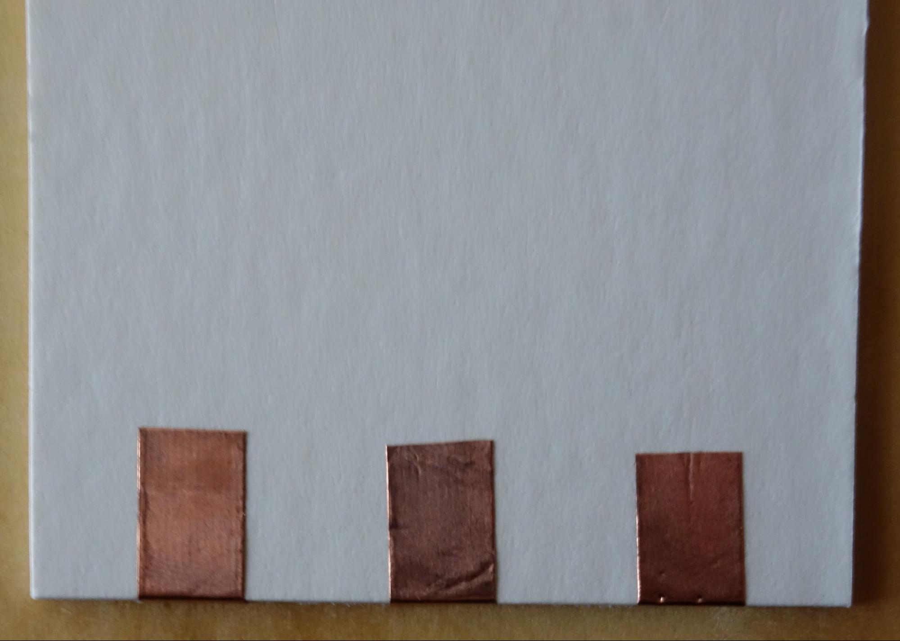

## Make a Paper Survey

### Materials:

* “Scratch Paper” OpenLog (build instructions below)
* A [MicroSD card](https://www.google.com/url?q=https://www.sparkfun.com/products/13833&sa=D&ust=1522256720713000) formatted as FAT16 or FAT32 and a way to read it (eg. a [reader](https://www.google.com/url?q=https://www.sparkfun.com/products/13004&sa=D&ust=1522256720713000) if your computer does not have a SD card port)
* [Chibi Chip and Clip](https://www.google.com/url?q=https://chibitronics.myshopify.com/collections/advanced-stickers/products/chip-clip&sa=D&ust=1522256720714000)
* 3 Alligator clips
* [3-Button Survey Template Handout](https://www.google.com/url?q=https://drive.google.com/open?id%3D1eQSuTzhWdfYVm7WIpVoz9MceFz2uHTUh&sa=D&ust=1522256720714000)
* LTC Binder (or a battery pack + hard surface such as a clipboard)

### Instructions:

1. Print out the template and run copper tape over the gray lines (making sure to fold at corners rather than breaking the tape).
2. Cut along the solid lines to create the button flaps.
3. Add your survey question, and write in answers on your buttons.
3. Upload this code to your Chibi Chip (you can change the answer text first, if you like).
4. Go forth and collect data!
5. To upload your data as a Google Sheet: Unplug one of the +5V or GND alligator clips to turn off the power, then remove the microSD card from its slot (push down and it should click out of its slot). Connect the microSD card to your computer. Upload the most recent file to your computer.

| | | |
------------- | ------------- | ------------
  |  | 

## Build a “Scratch Paper” OpenLog

“Scratch Paper” is a clever way to use ordinary electronics components with paper circuits in a modular, reusable way. Here’s how to make one that will log data.

### Materials:
* Sparkfun OpenLog
* A MicroSD card formatted as FAT16 or FAT32
* Cardboard backing (we used a 2” by 2” square)
* Copper tape (¼ inch)
* Solid core or stranded wire, soldering iron, solder
* Scotch tape
* Hot glue or double sided tape

### Instructions:
1. Wrap 3 pieces of copper tape around your square of cardboard.
 Tip: On the back, use a piece of scotch tape to anchor the ends so they don’t peel up.

2. Solder the following connections from the OpenLog to the copper tape:

 * GND ----> GND
 * VCC ----> +5V
 * RX ----> TXT

3. Use double stick tape or a little bit of hot glue to affix the OpenLog to the cardboard.

4. To connect to the Chibi Chip, use alligator clips as shown at right.

**Note**: always make sure to disconnect power before inserting or removing the microSD card. You can do this by disconnecting the +5V or the GND alligator clip.

| | |
------------- | -------------
 | 

## Build a “Scratch Paper” ESP 8266

### Materials:
* Adafruit Feather Huzzah ESP 8266
* MicroUSB cable
* Cardboard backing
* Copper tape (¼ inch)
* Solid core or stranded wire, soldering iron, solder
* Scotch tape
* Hot glue or double sided foam tape

### Instructions

1. Prepare cardboard by wrapping 10 pieces of copper tape around the edges (or as many as the Feather pins you would like to break out)

2. Strip and solder wires to the Feather pins, then strip and solder the ends to the copper tape.

3. In order to use the demo code, set up your Feather to use Arduino rather than Lua. 
Follow instructions here to install the Arduino bootloader:https://learn.adafruit.com/adafruit-feather-huzzah-esp8266/using-arduino-ide
Upload the code linked here to your Feather to get started:

4. The example code retrieves AQI from an online API. To use it, you’ll need your own API key to tell the air quality server who is making the request. You can get one here (for free): https://docs.airnowapi.org/, then put the number in the marked place in the code.

## The "One Hour" Paper Data Dashboard

